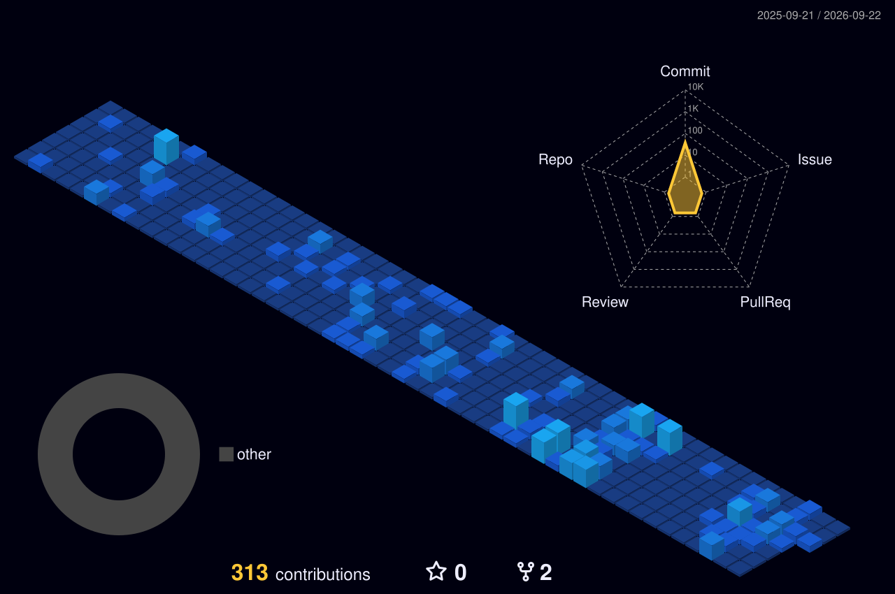

<!-- Hero: a focused introduction with one consistent dark-blue visual system. -->

  

  
  
  
  

<!-- Introduction: concise positioning around the work that matters most. -->

## About

I build practical AI products and polished cross-platform experiences with Flutter. My focus is turning ambitious ideas into useful, intuitive software through thoughtful product decisions, clean interfaces, and reliable engineering.

<!-- Current work: active product directions, intentionally kept short. -->

## Currently Building

- **Zaper AI** - intelligent tools that make everyday workflows faster and simpler.
- **Japanese Story Reader** - an accessible reading experience for learning Japanese through stories.
- **AI-powered Flutter applications** - mobile products that combine useful AI with native-quality UX.

<!-- Stack: compact badges use the same dark background and blue accent. -->

## Tech Stack

  
  
  
  
  
  
  
  

<!-- Featured work: only the strongest currently public repositories. -->

## Featured Projects

  
   
  
   
  

<!-- Core GitHub signals: stats, streak, and activity graph retained from the previous profile. -->

## GitHub Overview

  
  

  

<!-- Metrics: generated weekly by .github/workflows/metrics.yml and collapsed to keep the profile concise. -->

  
<strong>GitHub Metrics Dashboard</strong>

   
  

    
  

<!-- 3D calendar: generated daily by .github/workflows/profile-3d.yml. -->

  
<strong>3D Contribution Calendar</strong>

   
  

    
  

<!-- Spotify: authorize once at https://spotify-github-profile.kittinanx.com/api/login if the card is not active. -->

## Now Playing

  

<!-- Daily quote: dynamically refreshed by the quote card service. -->

## Daily Developer Quote

  

<!-- Snake: generated daily and published to the output branch by .github/workflows/snake.yml. -->

## Contributions

  <picture>
    <source media="(prefers-color-scheme: dark)" srcset="https://raw.githubusercontent.com/AimJ-dilini/AimJ-dilini/output/github-snake-dark.svg" />
    <source media="(prefers-color-scheme: light)" srcset="https://raw.githubusercontent.com/AimJ-dilini/AimJ-dilini/output/github-snake.svg" />
    
  </picture>

<!-- Footer: a restrained close that matches the hero without extra animation. -->

  Building useful products at the intersection of AI, mobile, and thoughtful design.

