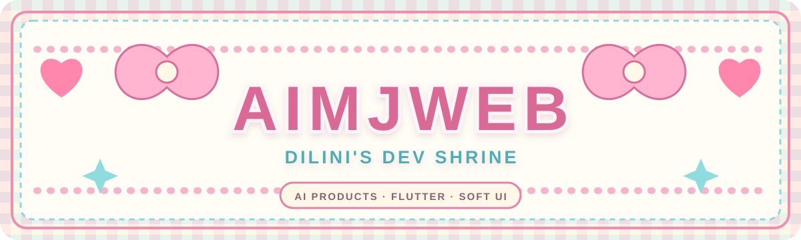
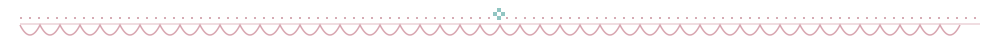
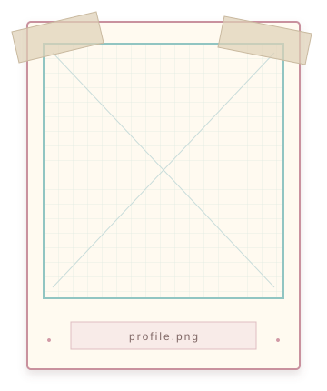
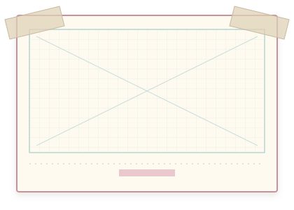
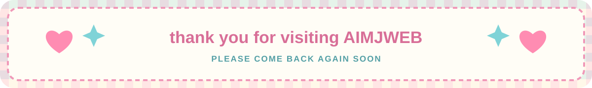

<!--
Dilini's Dev Shrine
Original local SVG artwork lives in /assets.
-->

<a href="#profile">about</a>
&nbsp;&nbsp;&middot;&nbsp;&nbsp;
<a href="#project-gallery">project gallery</a>
&nbsp;&nbsp;&middot;&nbsp;&nbsp;
<a href="#build-notes">build notes</a>
&nbsp;&nbsp;&middot;&nbsp;&nbsp;
<a href="#archive">archive</a>
&nbsp;&nbsp;&middot;&nbsp;&nbsp;
<a href="#guestbook">guestbook</a>

<em>A soft archive of things I build, learn, and leave on the web.</em>

<table>
<tr>
<td width="22%" valign="top">

<h3 align="center">INDEX</h3>

<a href="https://github.com/AimJ-dilini/AimJ-dilini#readme">01 / entrance</a> 
<a href="#profile">02 / profile</a> 
<a href="#project-gallery">03 / gallery</a> 
<a href="#build-notes">04 / build notes</a> 
<a href="#archive">05 / archive</a> 
<a href="#guestbook">06 / guestbook</a>

<h3 align="center">LINKS</h3>

<a href="https://github.com/AimJ-dilini?tab=repositories">repositories</a> 
<a href="https://www.linkedin.com/in/dilini98">linkedin</a> 
<a href="https://dev.to/aimj">dev.to</a> 
<a href="https://www.instagram.com/hp_dilini">instagram</a> 
<a href="mailto:hpdilinibuddhika@gmail.com">email</a>

<h3 align="center">STATUS</h3>

<strong>online</strong> / yes 
<strong>location</strong> / Sri Lanka 
<strong>focus</strong> / Flutter + AI

</td>
<td width="52%" valign="top">
<h2 align="center" id="profile">ABOUT THE WEBMASTER</h2>

<strong>Dilini</strong> 
AI Product Builder / Flutter Developer

I build thoughtful mobile products, experiment with AI, and care about interfaces that feel clear, useful, and quietly memorable.

<h2 align="center" id="project-gallery">PROJECT GALLERY</h2>

selected work / open each frame to visit the repository

 
<strong>Zaper AI</strong> 
AI product experiments and smart app experiences

 
<strong>Flutter RPG</strong> 
A Flutter interface for building RPG characters

 
<strong>ChatGPT App</strong> 
A mobile exploration of conversational AI

 
<strong>Todo Hive App</strong> 
A clean local-first productivity app

<h2 align="center" id="build-notes">BUILD NOTES</h2>

<strong>Currently:</strong> Zaper AI, AI-powered Flutter interfaces, and polished mobile product experiences.

<strong>Interested in:</strong> Useful AI features, design systems, calm UI, and products with a strong point of view.

<strong>Working style:</strong> Prototype, test, simplify, and keep refining the details.

</td>
<td width="26%" valign="top">

<h3 align="center">DEV SHELF</h3>

<h3 align="center">UPDATE LOG</h3>

<strong>06.13.26</strong> 
reopened the shrine with a softer layout

<strong>06.10.26</strong> 
building AI-powered Flutter apps

<strong>06.01.26</strong> 
polishing product UI

<h3 align="center" id="guestbook">GUESTBOOK</h3>

Thanks for visiting this small corner of the web.

<a href="mailto:hpdilinibuddhika@gmail.com">leave a note</a> 
<a href="https://www.linkedin.com/in/dilini98">sign via LinkedIn</a>

</td>
</tr>
</table>

<h2 align="center" id="archive">GITHUB ARCHIVE</h2>

small records from behind the shrine

