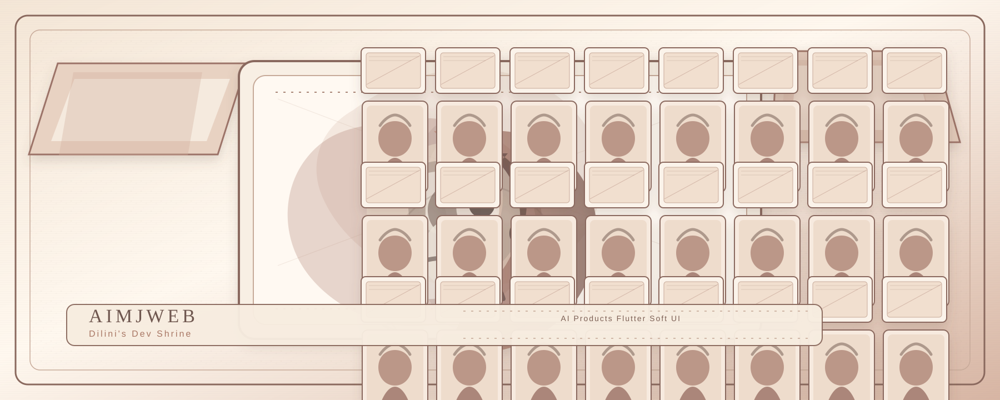
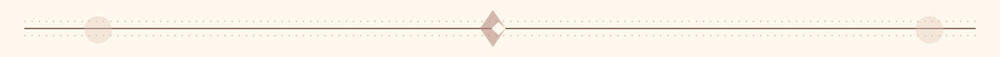
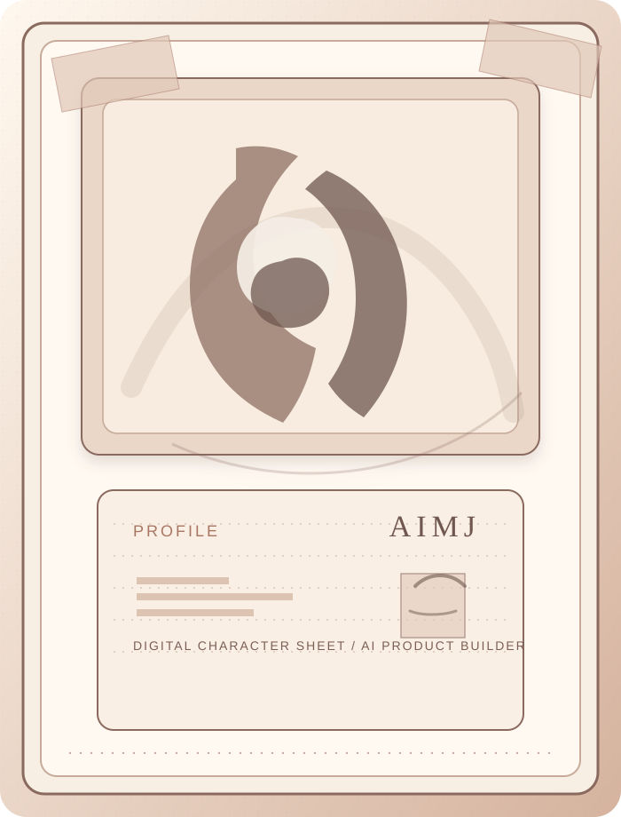
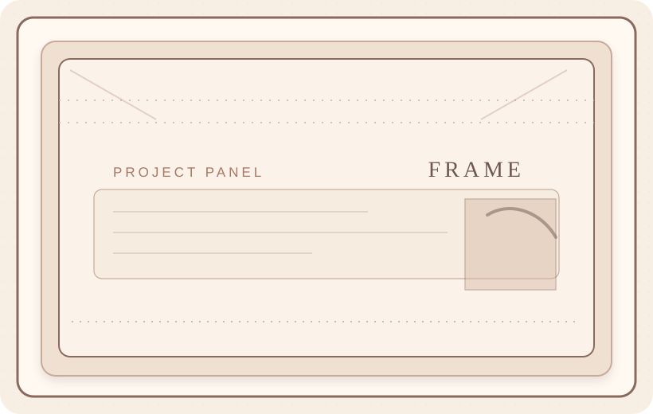
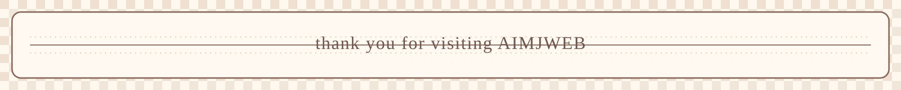

<!--
Dilini's Dev Shrine
Original SVG artwork lives in /assets.
-->

<a href="https://github.com/AimJ-dilini/AimJ-dilini#readme">Home</a>
&nbsp;&nbsp;&middot;&nbsp;&nbsp;
<a href="#profile">Profile</a>
&nbsp;&nbsp;&middot;&nbsp;&nbsp;
<a href="#project-gallery">Projects</a>
&nbsp;&nbsp;&middot;&nbsp;&nbsp;
<a href="#build-room">Build Room</a>
&nbsp;&nbsp;&middot;&nbsp;&nbsp;
<a href="#guestbook">Guestbook</a>

<em>Welcome to my anime poster-style developer shrine.</em>

<table>
<tr>
<td width="22%" valign="top">
<h3 align="center">DIRECTORY</h3>

<a href="https://github.com/AimJ-dilini/AimJ-dilini#readme">Home</a> 
<a href="https://github.com/AimJ-dilini?tab=repositories">Repositories</a> 
<a href="#project-gallery">Projects</a> 
<a href="https://github.com/AimJ-dilini?tab=repositories&q=zaper">Zaper AI</a> 
<a href="https://github.com/AimJ-dilini/flutter_rpg">Flutter RPG</a> 
<a href="https://github.com/AimJ-dilini/chatgpt_app">ChatGPT App</a> 
<a href="https://github.com/AimJ-dilini/todo_hive_app">Todo Hive App</a> 
<a href="#build-room">Build Room</a> 
<a href="#guestbook">Message Me</a>

<h3 align="center">UPDATE LOG</h3>

<strong>06.12.26</strong> 
redesigning my GitHub shrine

<strong>06.10.26</strong> 
building AI-powered Flutter apps

<strong>06.07.26</strong> 
tuning soft UI components

<strong>06.01.26</strong> 
polishing product flows

<h3 align="center">VISITOR LOG</h3>

 

</td>
<td width="52%" valign="top">
<h2 align="center" id="profile">PROFILE CARD</h2>

<strong>Name:</strong> Dilini 
<strong>Role:</strong> AI Product Builder / Flutter Developer 
<strong>Location:</strong> Sri Lanka 
<strong>Building:</strong> Zaper AI 
<strong>Design Direction:</strong> Soft, playful product systems 
<strong>Favorite Work:</strong> Clean UI, AI apps, product experiences 
<strong>Email:</strong> <a href="mailto:hpdilinibuddhika@gmail.com">hpdilinibuddhika@gmail.com</a>

Hi, Im Dilini. I build clean mobile experiences with Flutter and explore how AI can make apps smarter, softer, and more useful.

<h2 align="center" id="project-gallery">DEV SHRINE / PROJECT GALLERY</h2>

selected work framed like printed poster panels

 
<strong>Zaper AI</strong>  
AI product experiments and smart app experiences

 
<strong>Flutter RPG</strong>  
A Flutter interface for building RPG characters

 
<strong>ChatGPT App</strong>  
A mobile exploration of conversational AI

 
<strong>Todo Hive App</strong>  
A clean local-first productivity app

<h2 align="center" id="build-room">BUILD ROOM</h2>

<strong>Currently Building:</strong> Zaper AI, AI-powered Flutter interfaces, clean mobile product experiences, and this personal GitHub shrine.

<strong>Current Focus:</strong> Flutter UI, AI features, product polish, smooth user experiences, and soft but professional design systems.

</td>
<td width="26%" valign="top">
<h3 align="center">STATUS</h3>

<strong>Online:</strong> yes 
<strong>Mood:</strong> building mode 
<strong>Focus:</strong> Flutter + AI 
<strong>Current Quest:</strong> Zaper AI 
<strong>Side Quest:</strong> profile shrine polish 
<strong>UI Energy:</strong> soft, clean, expressive

<h3 align="center">TECH STICKERS</h3>

<h3 align="center" id="guestbook">GUESTBOOK</h3>

thanks for visiting my little corner of GitHub

<a href="https://www.linkedin.com/in/dilini98">LinkedIn</a> 
<a href="https://dev.to/aimj">Dev.to</a> 
<a href="https://www.instagram.com/hp_dilini">Instagram</a> 
<a href="mailto:hpdilinibuddhika@gmail.com">Email</a>

</td>
</tr>
</table>

<h2 align="center" id="archive">GITHUB STATS TERMINAL</h2>

<em>little numbers from behind the shrine</em>

<h2 align="center">CONTRIBUTION STREAM</h2>

<em>little pixels moving through my contribution trail</em>

<picture>
<source media="(prefers-color-scheme: dark)" srcset="https://raw.githubusercontent.com/AimJ-dilini/AimJ-dilini/output/github-snake-dark.svg" />
<source media="(prefers-color-scheme: light)" srcset="https://raw.githubusercontent.com/AimJ-dilini/AimJ-dilini/output/github-snake.svg" />

</picture>

please visit AIMJWEB again soon 

