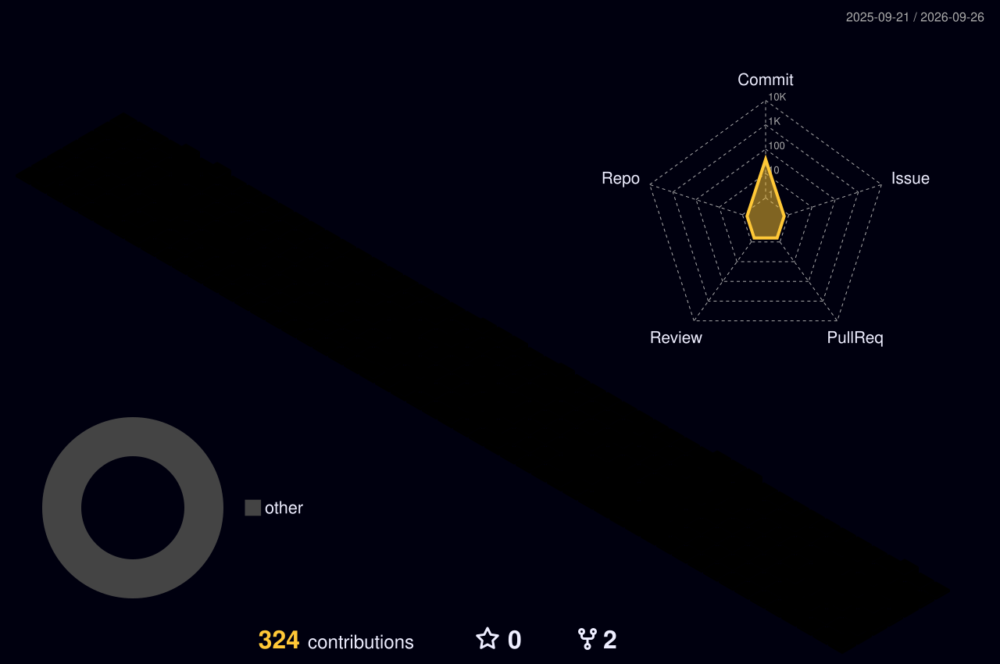

<!--
  Dilini's GitHub Profile
  Flutter • AI • Product UI
-->

<div align="center">

<p align="center">
  
  
  
</p>

<br />

# Hi, I'm Dilini 👋

### Flutter Developer · AI Product Builder · UI Explorer


<br />

<a href="#about-me">
  
</a>
<a href="#selected-work">
  
</a>
<a href="#tech-stack">
  
</a>
<a href="#connect">
  
</a>

<br /><br />


</div>


<br /><br />
<div align="center">
  
</div>

<br />
<p align="center">
  
</p>

## About Me

<a id="about-me"></a>

Hi! I'm **Dilini**, a developer who enjoys building clean, thoughtful and expressive digital products.

My main focus is **Flutter development**, while I'm also exploring how **AI, backend systems and good product design** can work together to create better mobile experiences.

I especially enjoy the space between **design and development** — taking an idea from a rough concept and turning it into something that looks polished and actually works.

```text
Role          Flutter Developer / AI Product Builder
Focus         Flutter • AI • Product UI
Currently     Building and improving mobile products
Interests     Clean UI • AI Apps • Product Experiences
```

> I like interfaces that feel simple at first glance,
> but have a lot of thought behind them.

<br />

## Tech Stack

<a id="tech-stack"></a>

<div align="center">


<br /><br />

`Flutter`
  `Dart`
  `React`
  `TypeScript`
  `Node.js`
  `Express`

`PostgreSQL`
  `Firebase`
  `Docker`
  `Git`
  `GitHub Actions`
  `Figma`

</div>

<br />

## Currently Building

I'm currently spending most of my time around:

* 📱 Flutter mobile applications
* ✨ Clean and polished product interfaces
* 🤖 AI-powered app features
* 🧠 Better application architecture
* ⚙️ Backend development with Node.js
* 🎨 UI systems that feel simple, soft and professional

```yaml
current_focus:
  mobile: Flutter
  backend: Node.js
  ai: AI-powered product features
  design: clean and expressive interfaces

learning:
  - backend architecture
  - product engineering
  - AI integration
  - better Flutter architecture
```

<br />


<p align="center">
  
</p>

## Selected Work

<a id="selected-work"></a>

<table>
<tr>

<td width="50%" valign="top">

### 🤖 AI Chat Mobile

**Flutter + AI application**

A conversational AI mobile experiment built with Flutter and a custom Node.js / Express backend.

The backend handles communication with the AI service so sensitive credentials are not stored inside the mobile application.

**Built with**

`Flutter` `Dart` `Node.js` `Express` `AI`

<br />

<a href="https://github.com/AimJ-dilini/chatgpt_app">

</a>

</td>

<td width="50%" valign="top">

### ✅ TaskNest

**Local-first productivity app**

A minimal Flutter task manager focused on simple interactions, responsive UI and fast local persistence.

**Highlights**

`Offline Storage` `Hive` `Animations` `Responsive UI`

<br />

<a href="https://github.com/AimJ-dilini/todo_hive_app">

</a>

</td>

</tr>

<tr>

<td width="50%" valign="top">

### 🎮 Flutter RPG

**Character selection experience**

A Flutter project exploring RPG-style character interfaces and interactive mobile UI.

**Built with**

`Flutter` `Dart` `Firebase`

<br />

<a href="https://github.com/AimJ-dilini/flutter_rpg">

</a>

</td>

<td width="50%" valign="top">

### ✨ Current Experiments

Working on ideas involving:

* AI-assisted mobile experiences
* Flutter product development
* Interactive UI
* Better user flows
* Backend integration

<br />


</td>

</tr>
</table>

<br />

<div align="center">

<a href="https://github.com/AimJ-dilini?tab=repositories">

</a>

</div>

<br />

<p align="center">
  
</p>

## GitHub Activity

<div align="center">


</div>

<br />
  
<div align="center">



</div>
<br /><br />
### Contribution Trail

<div align="center">

<picture>
  <source
    media="(prefers-color-scheme: dark)"
    srcset="https://raw.githubusercontent.com/AimJ-dilini/AimJ-dilini/output/github-snake-dark.svg"
  />
  <source
    media="(prefers-color-scheme: light)"
    srcset="https://raw.githubusercontent.com/AimJ-dilini/AimJ-dilini/output/github-snake.svg"
  />
  
</picture>

</div>

<br />

<p align="center">
  
</p>

## Let's Connect

<a id="connect"></a>

<div align="center">

I'm always interested in **Flutter, AI, UI design and interesting product ideas.**

<br /><br />

<a href="https://www.linkedin.com/in/dilini98">

</a>

<a href="https://dev.to/aimj">

</a> 

<a href="mailto:hpdilinibuddhika@gmail.com">

</a>
 
<br /><br />


<br /><br />

### Thanks for visiting 🌸

*See you in the next build.*

<br />

<p align="center">
  
  
  
</p>
</div>
